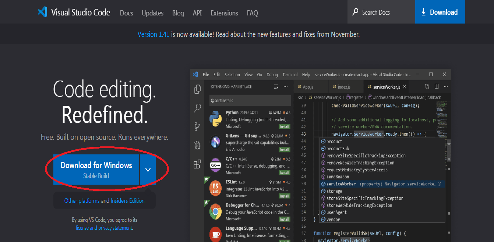
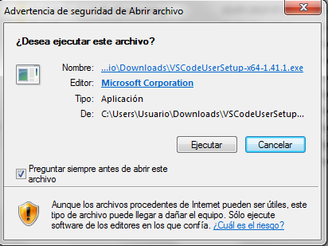

# Ejercicio de Markdown en Github

## Instalación de dotnet core 2.2.
descargar el archivo de instalacion del siguiente sitio..~ (°¬° ~)
[Este sitio](https://dotnet.microsoft.com/download/dotnet-core/2.2)
 Es de vital importacia el SDK por wur lo requerimos para programar

 La pagina tiene esta apariencia
 
 Luego procedemos a abrir el archivo que descargamos
 
 Aceptamos los terminos y condiciones y daremos siguiente a todas las opciones.

 Esperamos que termine la instalación y finalizamos.
 

## Instalación y configuración de Visual Studio Code para C#.

Comensaremos con entrar a este sitio web
[Sitio](https://code.visualstudio.com/)

Luego presionaremos descargar

A continuacion se descargara un archivo que procederemos a abrir
y se vera de esta forma.

Seleccionares ejecutar aceptaremos terminos y condiciones y daremos siguiente,luego veremos la ruta en la que se guardara el archivo e instalaremos despues de dar siguiente 2 ocasiones mas...
Esperaremos a que se instale y finalizaremos,

## Instalación de git. conectado a tu cuenta de GitHub y VSC.