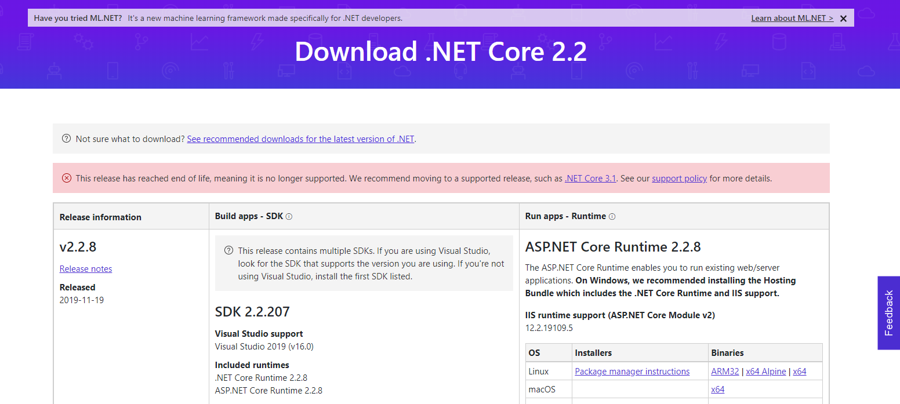

# Ejercicio de Markdown en Github

## Instalación de dotnet core 2.2.
descargar el archivo de instalacion del siguiente sitio..~ (°¬° ~)
[Este sitio](https://dotnet.microsoft.com/download/dotnet-core/2.2)
 Es de vital importacia el SDK por wur lo requerimos para programar

 La pagina tiene esta apariencia
 
 Luego procedemos a abrir el archivo que descargamos
 

## Instalación y configuración de Visual Studio Code para C#.

## Instalación de git. conectado a tu cuenta de GitHub y VSC.